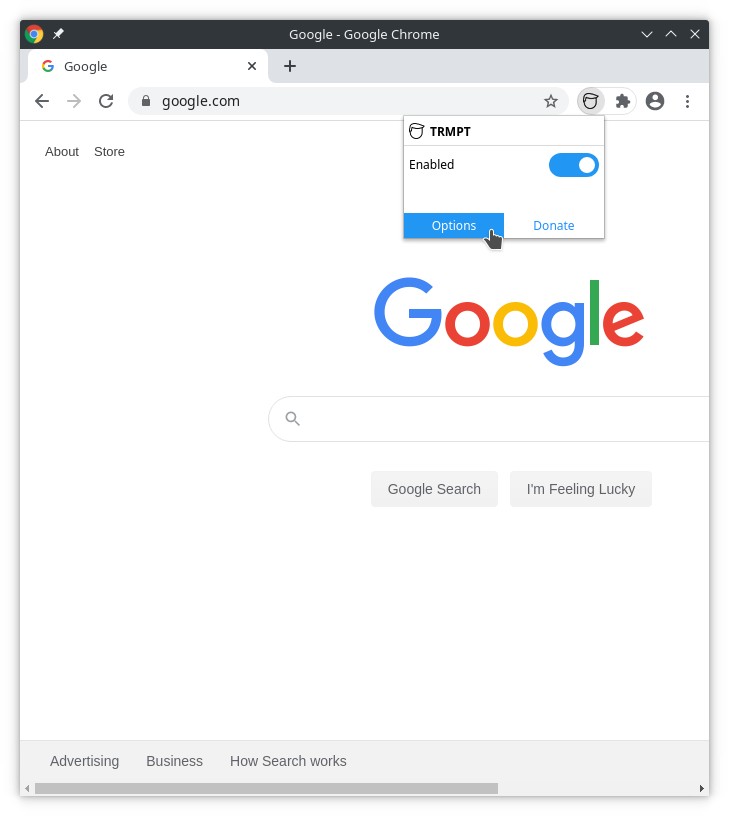
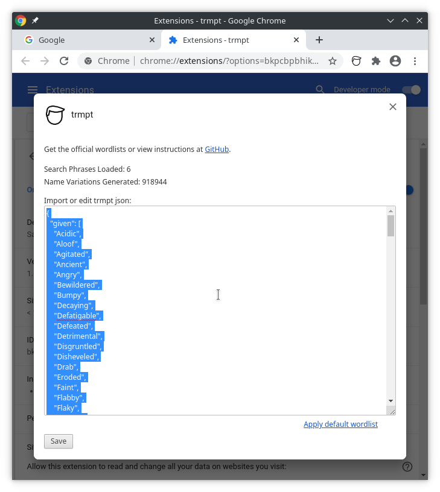
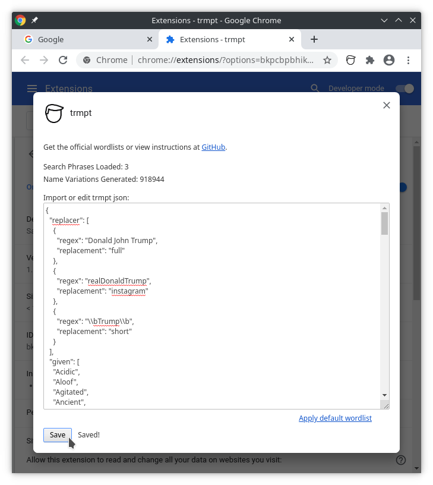

# Wordlists

Wordlists allow you to change the search phrases that will trigger a replacement as well as update the pool of words used during the replacement.

The extension comes pre-loaded with a default wordlist but that wordlist can be overridden with both official wordlists and community created versions.

The wordlists are listed below. As community lists are created, they will either be absorbed into the official list (see [contributing to the namelist](../CONTRIBUTE.md)) or added below.

| Wordlist | Description |
| -------- | ----------- |
| [default](default.json)  | matches Donald Trump as well as the various organizations sharing the name |

## Installing a wordlist

1. Click the link for the desired wordlist.
2. Copy the contents of the wordlist. This is made easier by clicking the `Raw` button in the GitHub window.
3. The remaining steps are demoed using Chrome but the same process works for Firefox.

4. Click the `trmpt` panel icon and click the `Options` button.
    

5. Select the contents of the existing wordlist.
    

6. Paste in the new wordlist and click the `Save` button.
    

7. Refresh any active tabs for the changes to take effect.
